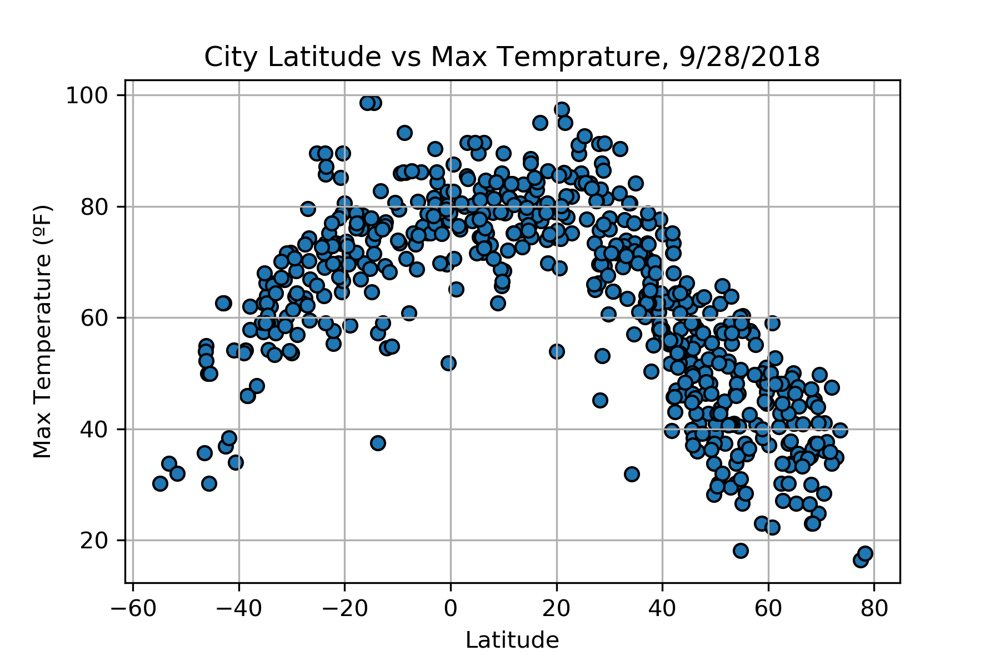
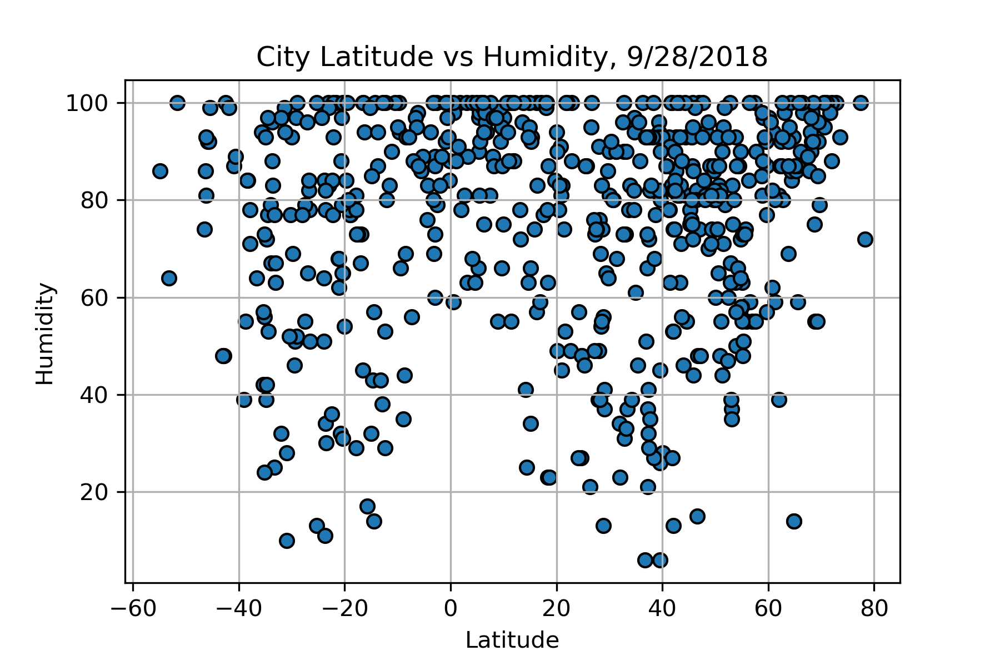
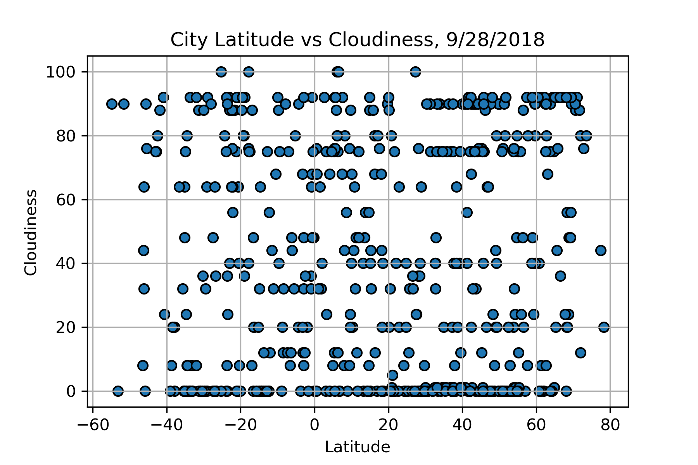
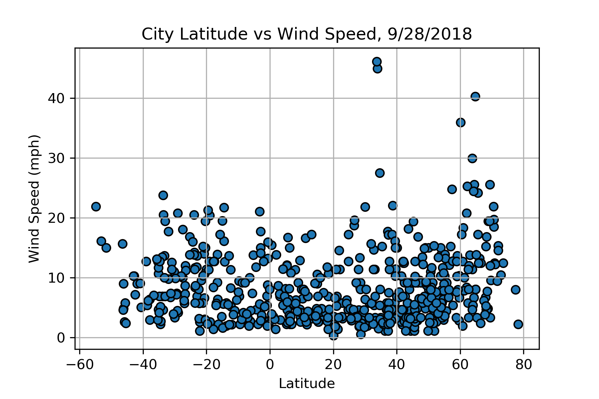

Temperatures are higher closer to the equator.

The random selection of cities includes a greater number of cities in the northern hemisphere
than in the southern hemisphere - a natural result of the commonly known fact that there is more inhabitable
land surface in the northern hemisphere.

There is a small trend toward higher humidty roughly 30 degrees latitude from the equator.

Cloudiness does not appear to be associated with latitude.

Wind speed increases at latitudes are higher than 60 degrees latitude.
Data is limited for cities lower than 60 degrees latitude.

